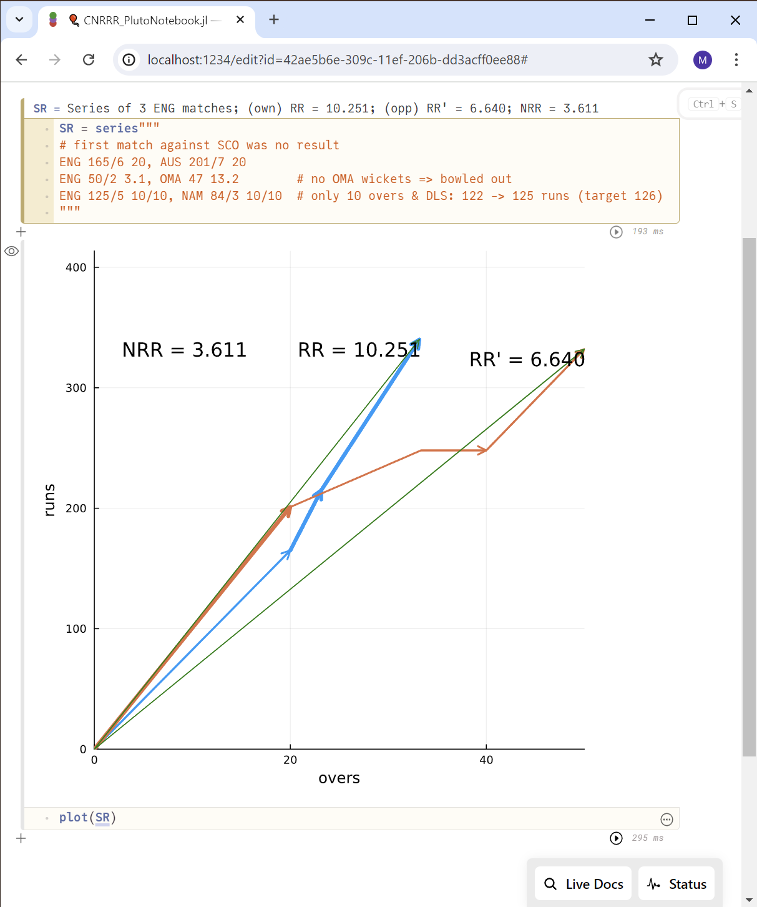
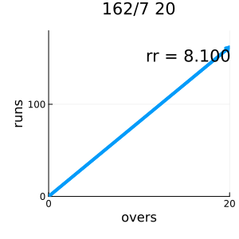
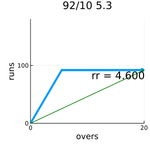
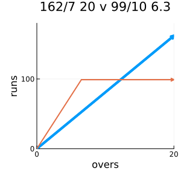

# Cricket Net Run Rate Rodeo!

The *net run rate* is used as tie-breaker in limited-overs cricket, much like goal difference in football.

Because this is cricket, this measure can be a bit opaque. We would like to build some intuition, and use vectors to visualize it in an interactive notebook. Here is how England's 2024 T20 world cup group stage looks like (fear not; explanation and install guide below):



*Note: only very few programming languages can even hope to tackle the intricacies of cricket. Haskell, cppfront, or Unison come to mind; we use Julia and Pluto notebooks.*

*Also note: I am new to cricket and Pluto workbooks, so please bear with and correct me!*

## WHAT - Net Run Rate

In cricket, a team scores *runs* from a set of *overs* of 6 *balls* each. A typical cricket format is *Twenty20* or *T20*, in which each team plays 20 overs.

The rate at which a team scores, the *run rate*, is -- intuitively -- runs divided by overs faced:

$$rr = \frac{runs}{overs}$$

There is just one little twist: if a team is bowled out, the full game overs instead of the ones actually played are applied. Here are three examples:

1. Our team bats first and is not bowled out -- it uses all available overs. It might score 162 runs off of the full 20 overs, with a run rate of 162/20 = 8.100. Easy.

2. Our team is bowled out in 5.3 overs, after scoring 92 runs. Here we must divide the runs by the full 20 overs; we get a run rate of 92/20 = 4.600.

3. Finally, a successful run chase might end in 142 runs after 13.2 overs, with wickets to spare. In this case, we use the overs played. (One detail: the notation of "13.2 overs" means 13 full overs plus 2 out of 6 balls, i.e., 13 + 2/6 as a number.) The run rate is 142/13.333 = 10.650.

For single games, the run rate is quite meaningless. We are rather interested in a team's performance over several games -- in its *overall run rate*. For this, we can take its total runs scored over all games, divided by the sum of all applicable overs:

$$RR = \frac{runs_1 + runs_2 + ...}{overs_1 + overs_2 + ...}$$

From this we subtract the other teams' overall run rate RR' from the same games to obtain a team's *net run rate* or *NRR*:

$$NRR = RR - RR'$$

## HOW - Cricket Vectors!

Now, NRR is a simple subtraction. It's the overall RR that is tricky -- it's a kind of weighted average, but not of the games' individual run rates, but rather their underyling runs and overs. Funnily, this operation is both employed sparingly (in the [mediant](https://en.wikipedia.org/wiki/Mediant_(mathematics)) function or Farey sequences, as the alert cricketer is aware), but encountered every single second (in elementary school, whenever kids fail to sum fractions).

Luckily, we can handle this operation with vectors. Witness the examples above as graphs:


1. Our first example above was a full-overs score of 162:

   

   The run rate is clearly the *slope* of this score vector.


2. Our second example was being bowled out:

   

   Our run rate is the slope of the green vector.

3. Finally, we had the winning run chase, with a smaller y-component of overs:

   


<br>
<br>

The visualize overall run rates RR, we can now simply add such vectors. Let's do it step by step, and look at two matches of our team against two opponents.

* Here is the first match -- our team (Italy, in blue) beat Australia (orange) by 63 runs; Australia were fast, but bowled out in their chase:

  

* In the second match, we beat India by 8 wickets, i.e., we surpassed their runs early:

  

<br>
<br>

We can combine our score vectors, and our opponents' ones for the overall run rates and the NRR:


The NRR is just the difference in the green RR vectors' slopes.

## WHY - To Bowl or to Bat?

In the 2024 T20 world cup, England had a scarily low NRR after their first loss by 36 runs to Australia, and had to decide whether to bowl or bat in their 2nd game against Oman.

Now, batting first means you will always create an own-score vector with the full 20 overs as y-component (if you are *not* bowled out, you just keep going till the end; if bowled out, the full overs are used for your run rate anyway). But this vector can go arbitrarily-high up.

Conversely, bowling (well) first might knock out your opponent early; your own vector is then essentially upper-bounded by the opponent's run score. Your vector is bounded, but you might risk more and go faster.

So the choice is between adding a large vector versus adding a smaller but steeper one.

England chose to bowl first. Here's the NRR graph:


Englands run rate in their Oman game was 50 in 3.1 overs, or 15.789. Let's assume batting first and for the full overs would have been slower. A lower rate of 10, or 200 runs,  would have been worse:


A rate of 11 -- not:


<br>
<br>
<br>
<br>

## How to Install

*Note: this is first prototype, so a few things could go wrong here..*

0. Install Julia, best by installing `juliaup` -- find  the instructions [here](https://github.com/JuliaLang/juliaup).

1. Clone this repo; it contains the Pluto notbook `CNRRR_PlutoNotebook.jl`. (*Hopefully this way of distributing the code allows users to easily tweak it locally.. still, this might change..*)

   Then `cd` to the cloned directory.

2. Run Julia and install Pluto:
   ```
   julia> import Pkg; Pkg.add("Pluto")
   ```

3. Run Pluto:
   ```
   julia> using Pluto; Pluto.run()
   ```
   This should open a web browser, where you can open `CNRRR_PlutoNotebook.jl`.

Now you should be able to edit cells with cricket series and matches, and to create plots!

<br>
<br>
<br>
<br>

#### Version History

* 0.1 Initial version. Enjoy!
